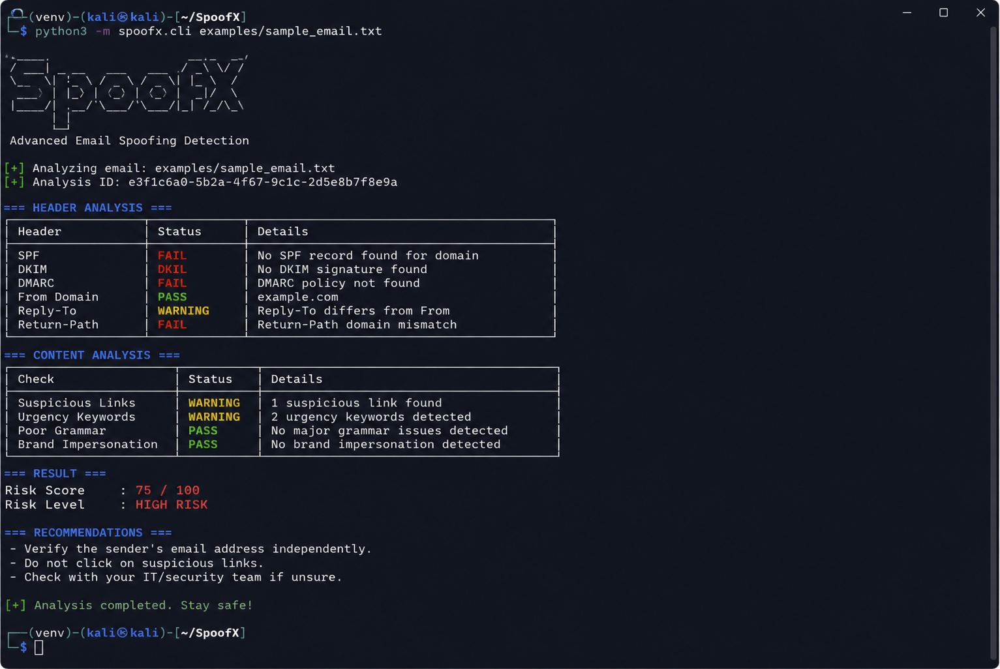

# 🛡️ SpoofX

**SpoofX** is a CLI-based email spoofing and phishing detection tool.
It analyzes email headers and content to detect spoofing attempts and assigns a risk score with a threat level.

Detects SPF/DKIM issues, phishing keywords, suspicious URLs, and calculates a risk score (Low/Medium/High).

---

##  Usage

```bash
python3 -m spoofx.cli examples/sample_email.txt
```

---

##  Demo


